# AMH Beauty

Ashleigh is a fully qualified and practicing beautician with many treatments to offer.
This website is designed to showcase some off Ashleighs work in the form of a 'Treatments'
section while also having an area dedicated to infomation about herself and links to constantly
updating social media. 

The live site can be viewed by clicking [here](https://coolusername244.github.io/MS1/).

## UX
---
This webpage is primarly targeted to a female audience while also allowing the involvement
of men, you can see this by male client photos, this is to make men feel more comfortable.

When loading the webpage, the users are greeted with a large hero image which showcases 
Ashleighs work.

With the presentation of the hero image, the selected fonts, text, colour scheme and logo, users get a clear indication that they are
on a page dedicated to beauty treatments.

Throughout the page, users are guided effortlessly to where ever they want to go, each treatment has its own button that will take you straight to the booking form, which you will not be able to send without having all the required infomation.

Users are also guided to AMH Beauty social media accounts with links in the footer of the page and also on ABOUT.html.

## Features
---

- Bootstrap Navbar

   - To allow for effortless navivation through the pages, i added bootstraps navbar which can be found [here](https://getbootstrap.com/docs/4.0/components/navbar/).

   - The navbar contains 3 links on mobile display (HOME/TREATMENTS/ABOUT) and 4 links on desktop view (previous 3 plus business logo directing back to HOME).  

   - When the navbar is being displayed on screens less than 992px in width, its collapses into a dropdown menu which is activated and expanded when pressing the burger icon in the top right. 

- Explore Button 

   - The Explore Button is our home page call-to-action. Upon being clicked, you will be directed to the to the TREATMENTS page. 

   - The Explore Button has been achieved by using Bootstraps .btn class within the 'a' attribute, as seen [here](https://www.w3schools.com/bootstrap/bootstrap_buttons.asp).

- Footer Links

   - The footer contains fully functioning links to the AMH Beauty Facebook and Instagram pages and a booking email template. The icons have been taken from [Font Awesome](https://fontawesome.com/).

- Treatments showcased

   - These are the most popular sellers for AMH Beauty and have therefore been showcased with their own sections dedicated to displaying the image for users of the quality of her work. 

   - The sections also contain the pricing and buttons that will take them to the booking form. 

- Bootstrap Carousel 

   - The carousel has been added to add more impact on to viewers who are intrested in the detail of the work and are even greeted by a male pictured in Ashleighs work.

   - The code for the carousel was taken from Bootstrap and can be viewed [here](https://getbootstrap.com/docs/4.0/components/carousel/)

- Booking Form 

   - Here, users are able to book their desired treatment from a drop down selection menu and are also clearly informed that they will need to fill out their details in the other fields with placeholder text.

   - All fields on the form have the required attribute meaning the user will not be able to submit the form with missing data.

## Technologies Used
---
- HTML5

   - Used to add and structure content

- CSS

   - Used to style content

- Bootstrap 

   - Used for aid in structuring code and adding in pre-existing templates for Navbar, carousel and booking form.

   - I also took full advantage of bootstraps grid system to enable smoother transitions across multiple devices widths.

- Font Awesome 

   - I have used 3 icons from Font Awesome for links in the footer of the page. 

- Google Fonts 

   - the google fonts that were used are as listed below:
   
        Playfair Display

        https://fonts.google.com/specimen/Playfair+Display?query=playfair
   
        Dancing Script

        https://fonts.google.com/specimen/Dancing+Script?query=dancing

- Google Chrome Developer Tools

   - Google Chrome Developer Tools were used throughout the process as an aid to make ure that all changes that were being implimented, worked properly. Also to test responsiveness on other device sizes. 

- HMTL Validator 

  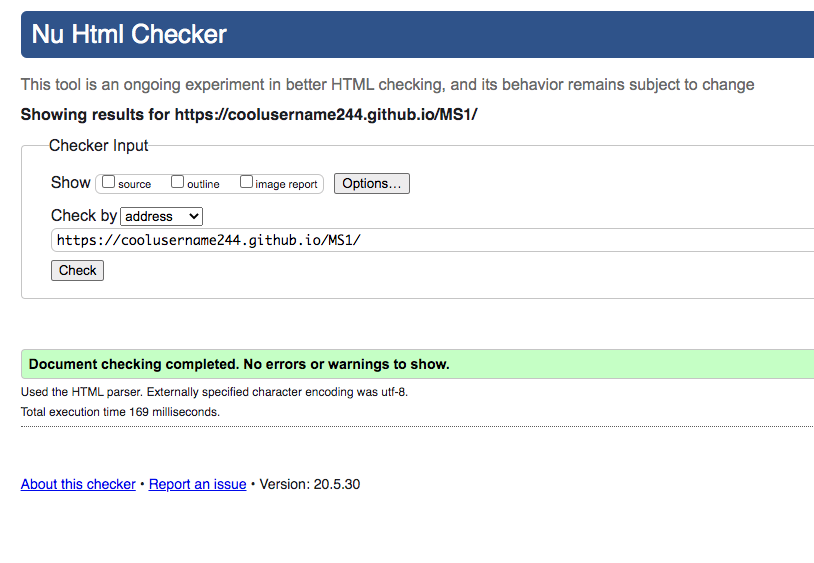

- CSS Validator

    - CSS Validator was used here also, but as you can see below, the resulting errors are due to the Bootstrap URI.

   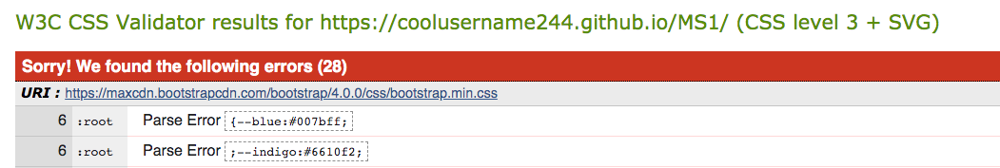

- Balsamiq

   - Through using Balsamiq, these are the wireframes that I created:

   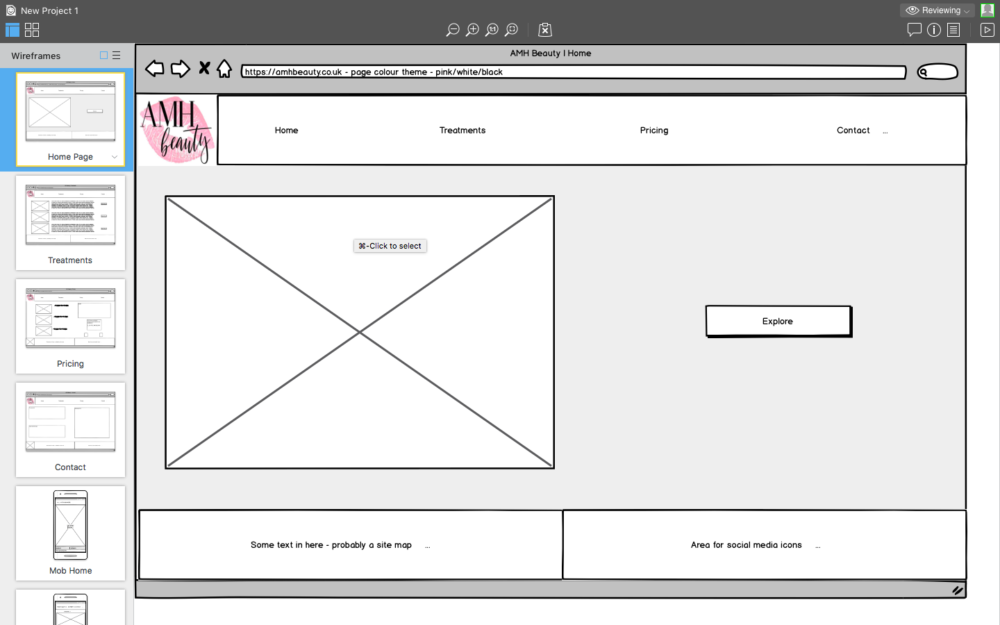
   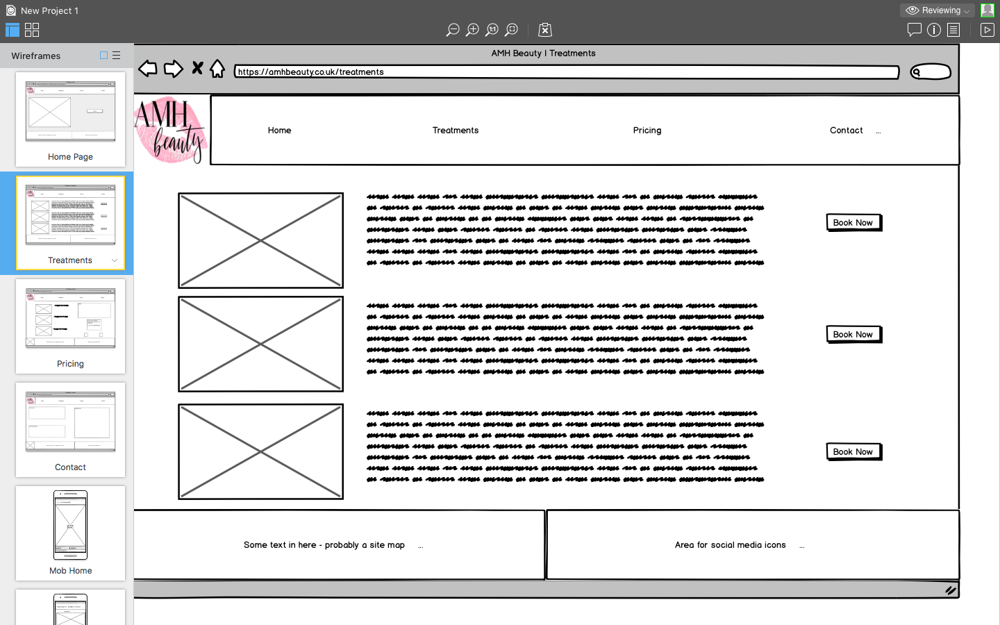
   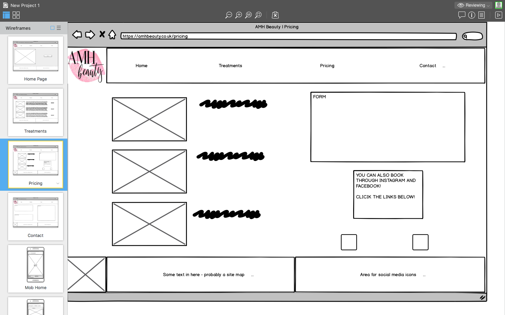
   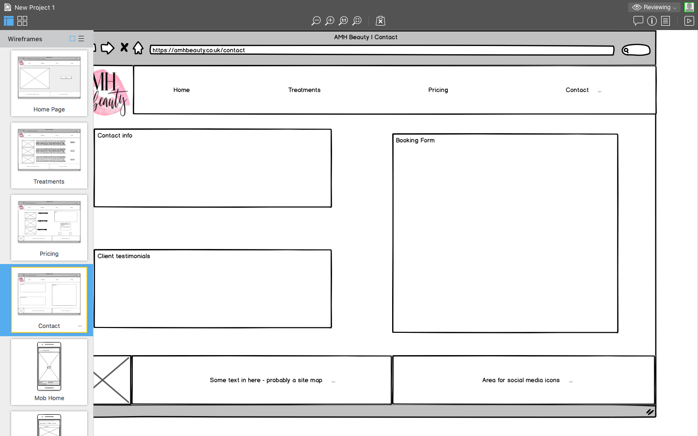
   
   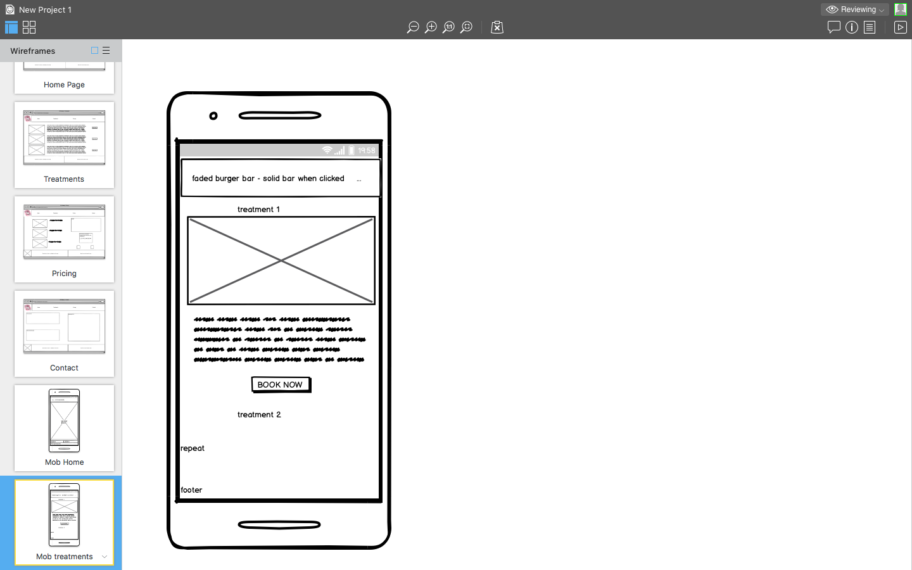
   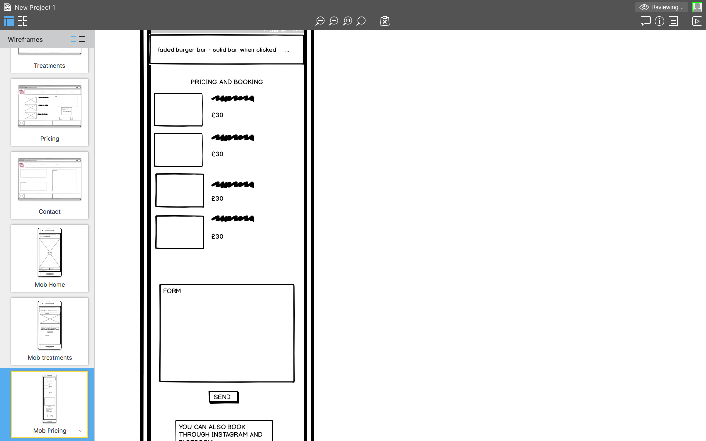

- BrowserStack

   - See below.

## Testing

- BrowserStack

   - With the use of Browserstack, I have been able to see how compatible the site is on various internet applications, the ones that have been tested are:
    
    Microsoft Edge

    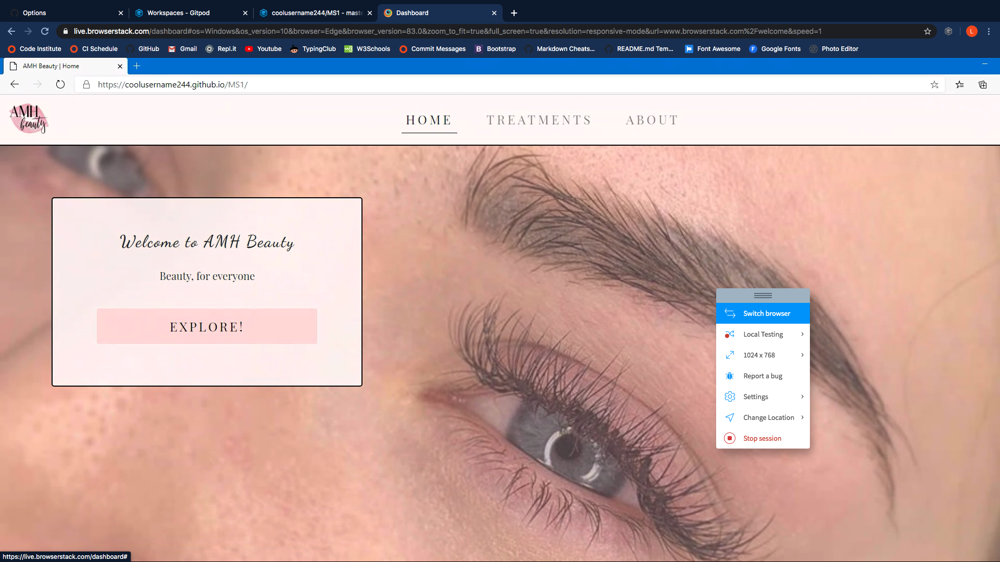

    Safari

    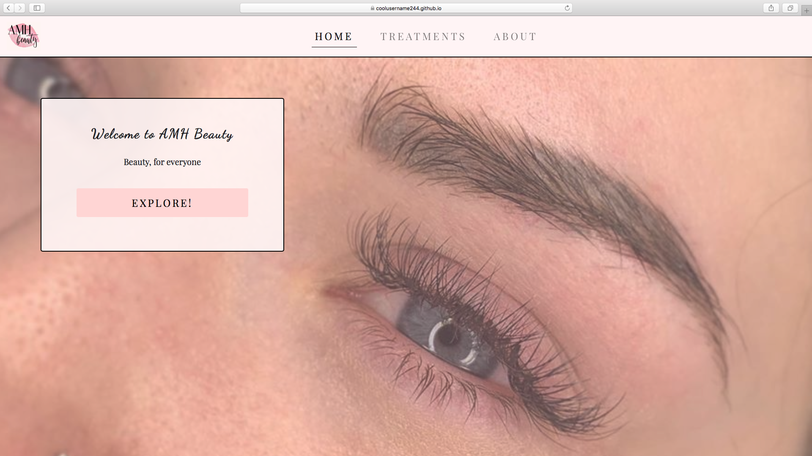

    Firefox

    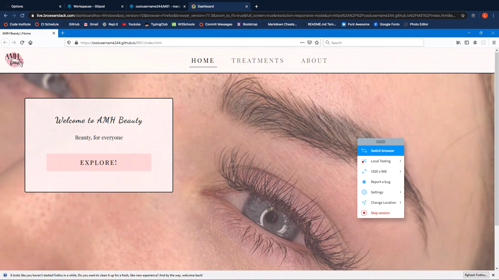

    Opera

    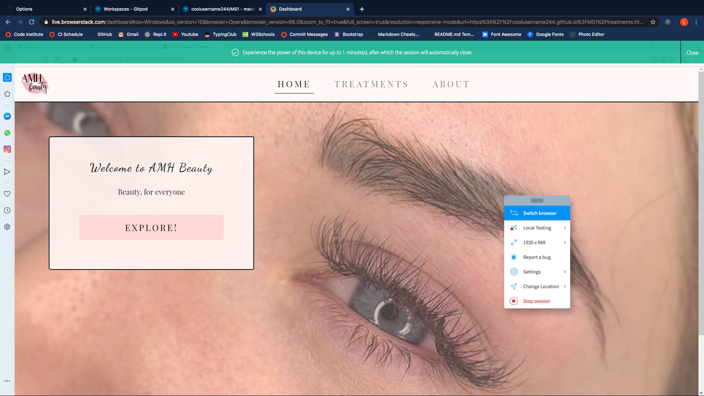

    Google Chrome

    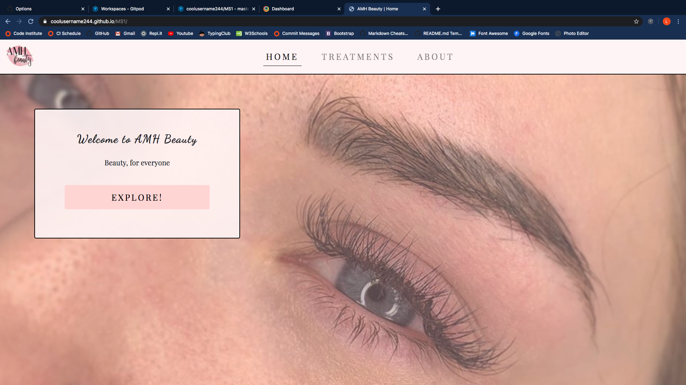

    Internet Explorer

    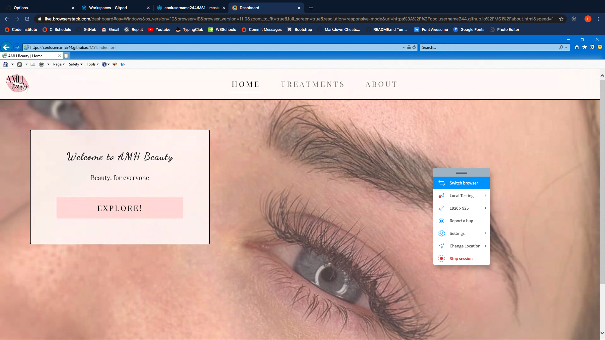

    All pages followed the same procedure:

    1 - Click explore

    2 - Click all 'book now' buttons, testing links to the booking form work
    
    3 - Try to submit booking form with data missing

    4 - Hover over each link in navbar to see if hover attribute works

    5 - Click on footer links to external sites, making sure that new windows are opened

    6 - Verify ABOUT.html social links work

    All tests passed on each browser. 

- Google Chrome Developer Tools

    This played a crutial part in the testing process as it was constantly being used when adding any new feature to the page, especially when they are positioned differently on different devices, as seen below:

    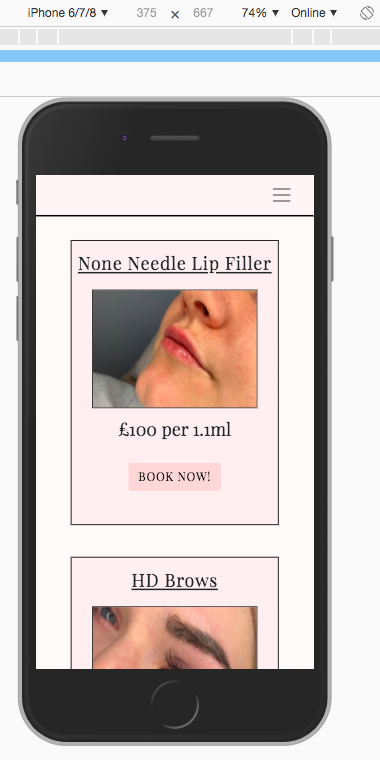

    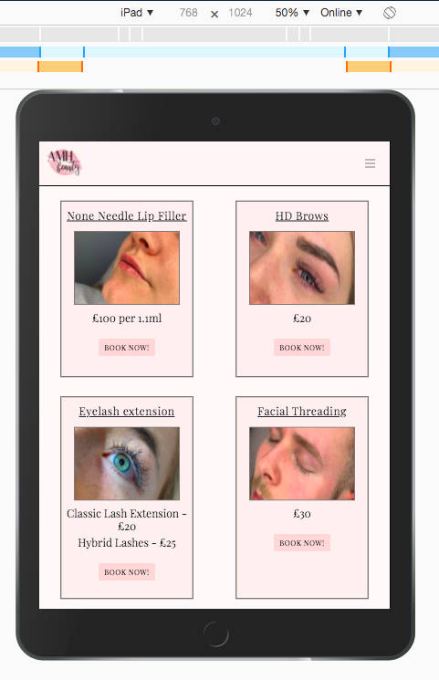

- Friends and Family

    When the webpage was nearlng completion, I decided to deploy the site so that a few of my 
    friends and family could try out the website and were asked give me feedback on how easy the site was to navigate,
    understand and if they were able to find any bugs. 

I also used the webpage on my own phone to get a real handheld feel of how the website is displayed to mobile viewers.

## Deployment
---

To deploy this site, I used GitHub pages.

With my documents stored in a [repository](https://github.com/coolusername244/MS1) in GitHub, went into the settings by clicking the settings icon in the top right of the screen.
Towards the bottom of the page, under 'GitHub Pages', I changed the source to the master branch, as seen below:

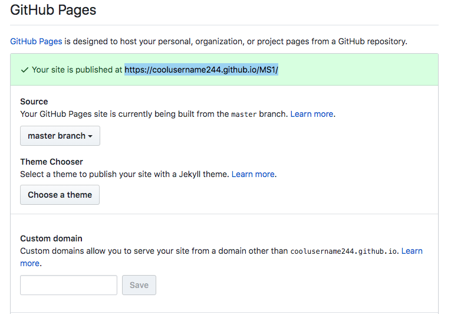

Live link - https://coolusername244.github.io/MS1/

## Credits
---
### Content
- **Navbar** - This was taken from [Bootstrap](https://getbootstrap.com/docs/4.0/components/navbar/) and styled to suit.
- **Carousel** - This was taken from [Bootstrap](https://getbootstrap.com/docs/4.0/components/carousel/) and styled to suit.
- **Booking Form** - This was taken from [Bootstrap](https://getbootstrap.com/docs/4.0/components/forms/)  and styled to suit.

### Media
- All photos were taken and are owned by Ashleigh Hocking of AMH Beauty
- The AMH Beauty logo was designed by Ashleigh Hocking
- All text written on ABOUT.html was authored by Ashleigh Hocking
- All prices are true according to AMH Beauty price lists ( 06/2020 )

### Acknowledgements

With all of this being something i'd never even thought i'd be doing at the beginning of 2020, my wife's continued support has made it all possible.

[Stackoverflow](https://stackoverflow.com/) has been there for me (and what seems like countless others) during times of need.

Another big help would be the likes of [YouTube](https://youtube.com), Code Institute Slack channels, my mentor, Gerry and my friends for reminding me that hard work always pays off.

